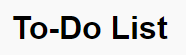
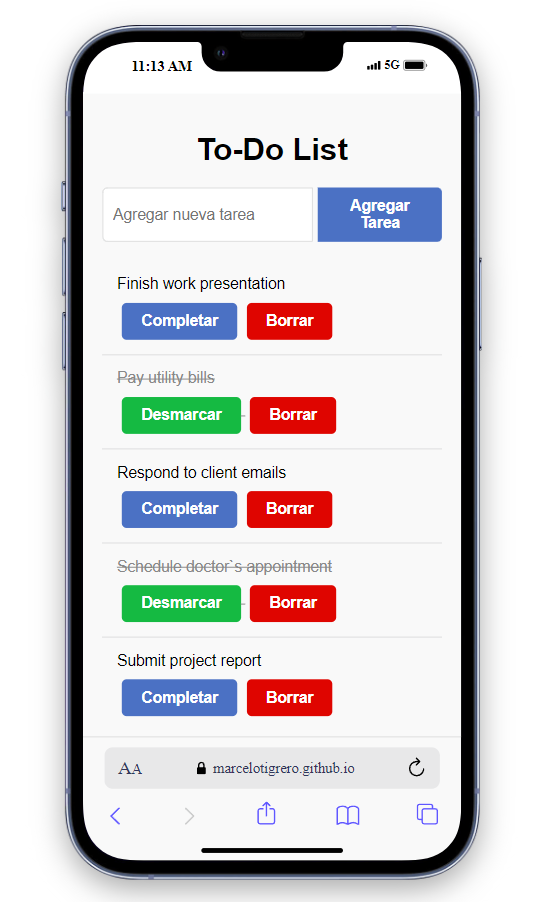
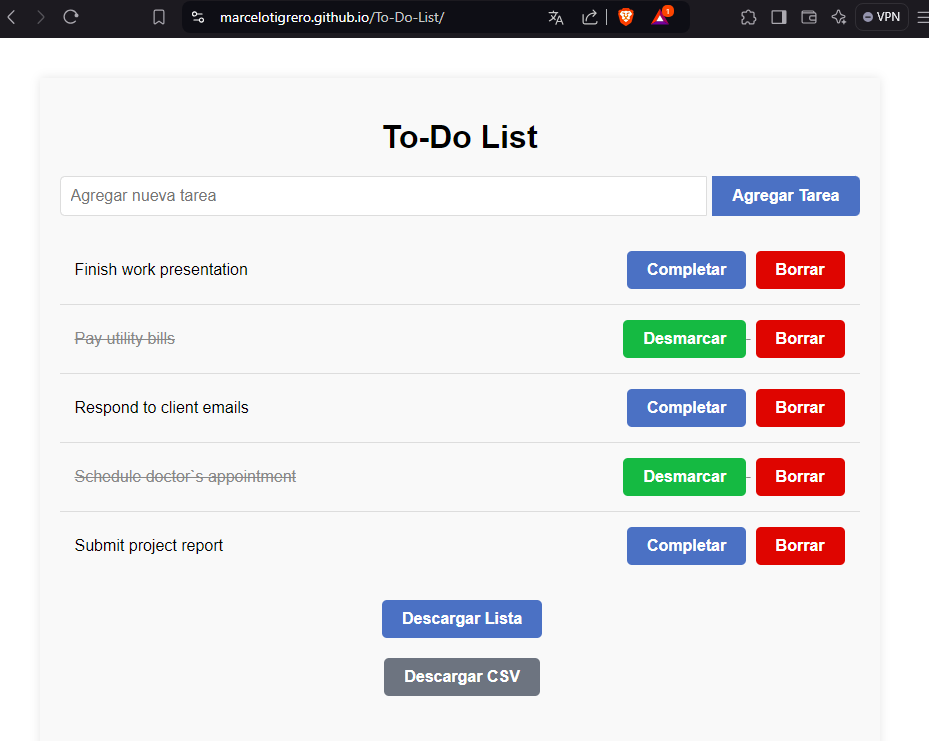

# To-Do-List Application




## Overview

This To-Do-List application is a simple yet powerful task management tool designed to help users organize their daily activities efficiently.

## Technologies Used

- 
- 
- 
- 

## Programming Paradigms

- Object-Oriented Programming  (OOP)
- Functional Programming
- Asynchronous Programming

## Problem Solved

This application addresses the common challenge of task management and organization. It provides a digital solution for creating, updating, and tracking tasks, replacing traditional paper-based to-do lists.

## How to Use

1. Clone the repository
2. Install dependencies: 
   ```bash
   npm install
   ```
3. Start the server:
   ```bash
   npm start
   ```

4. Open your browser and navigate to http://localhost:3000

## Live Demo

You can try out the To-Do-List application directly from your browser:

[https://marcelotigrero.github.io/To-Do-List/](https://marcelotigrero.github.io/To-Do-List/)

## Responsive Design

Our To-Do-List application is designed to work seamlessly across different devices:


*To-Do-List on mobile devices*


*To-Do-List on desktop browsers*

The responsive design ensures a consistent and user-friendly experience whether you're managing your tasks on the go or from your desktop.

## Author

This project is part of the portfolio of [Marcelo Tigrero](https://marcelotigrero.github.io/Portafolio/), Mechatronics Engineer.
